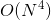
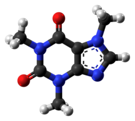
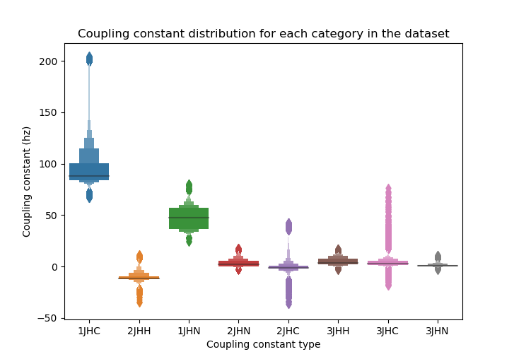
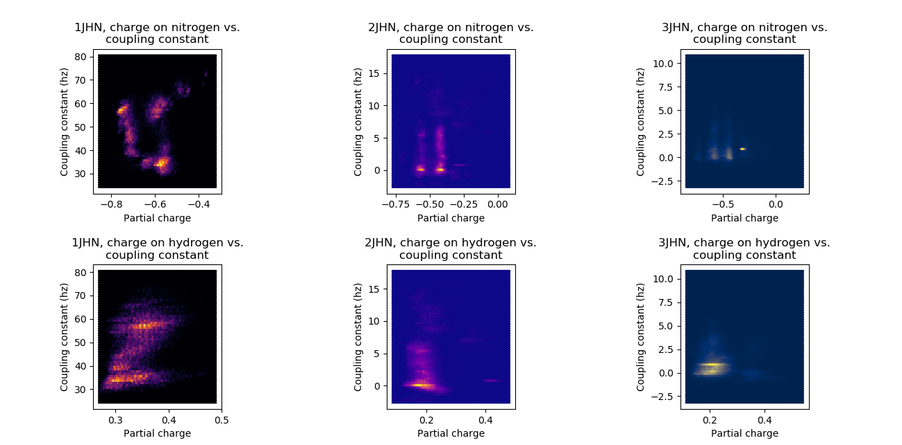
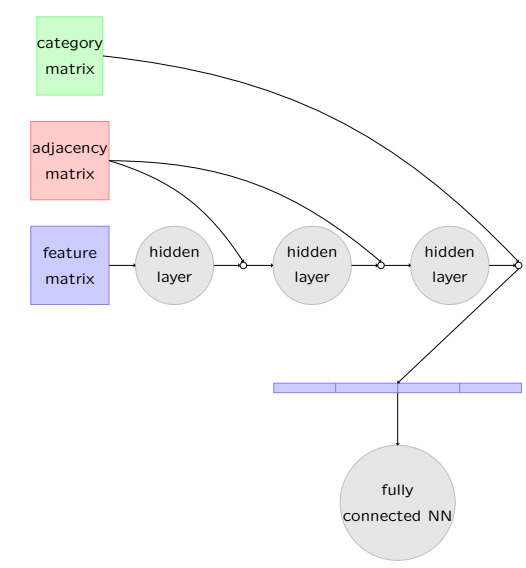
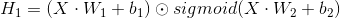
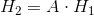
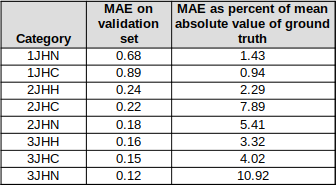

# Machine Learning for prediction of molecular properties using a graph convolutional network
This project is my pipeline for generating submissions for the Kaggle ["Predicting Molecular Properties"](https://www.kaggle.com/c/champs-scalar-coupling) competition. The goal is to predict NMR coupling constants for 2,505,541 atom pairs in the test set, using a training set of 4,658,147 atom pairs.

I started on the contest less than three weeks before it ended, so time pressure was a factor, especially since this was a spare-time project. My submission score was in the top 40% of entries. I packaged the model in an easy-to-use pipeline you can run using a single shell script to train the model and generate test set predictions (see How To Use below). Here are some quick guidelines on usage followed by background, my strategy and a summary of my results.

## Usage
This pipeline is intended for Linux, uses Python3 and will give errors with Python2. The Python packages you need are rdkit, PyTorch and numpy (install with Anaconda or pip). Finally, the pipeline uses a GPU to train the models and make predictions. If you want to set this up to run on CPU only, you'll have to comment any lines in the `convnet_gc.py` script that contain 'cuda'. Training these nns on CPU will however require some patience so using the pipeline as-is on a GPU is recommended.

So, to use this. First, clone the repo and extract moldict.gz, test.csv.gz and train.csv.gz. These are the raw data files the pipeline will need to build models. Next, run the following:

`chmod +x pipeline.sh`

`./pipeline.sh`

Running `pipeline.sh` with no options will give you a readout on usage and tell you what to do from there. It's pretty simple -- you can run `pipeline.sh` in train mode, to train a model for a specific coupling constant, or in test mode, to generate predictions for the test set for a specific coupling constant, and it will take care of the rest while you make yourself a cup of tea / grab a beer / hang out with your dog, come back in 20. Good times.

Only thing to be aware of -- depending on how much RAM you have, the 2JHC and 3JHC datasets MAY be too big to fit in memory. I had 32GB of RAM (sweet luxury) and didn't have any problems. Running the pipeline with `-l` will build features in such a way they are not loaded into memory during training set construction (memory-mapped numpy files) although it doesn't completely avoid potential problems during training. Given more time I would have implemented one of two more complete solutions (using sparse matrices to store features and reading minibatches from file one at a time rather than loading the whole dataset for training), but since I was able to get away with this on my machine and since the pipeline was for my use, I wasn't too concerned.

If you want to use the pipeline, I strongly suggest you start with the 1JHN, 2JHN or 3JHN datasets. These are smaller and will take much less time to train; even if you are not blessed with abundant RAM, they'll still be fine, and you can get a feel for how the pipeline works with these smaller datasets before training a model on 2JHC etc.

## Background
NMR is a technique related to MRI used by synthetic chemists to determine the structure of a molecule, like "MRI for molecules". Among the outputs generated by NMR are floating-point values called coupling constants, caused by magnetic interactions between pairs of atoms in molecules. The coupling constant for a specific pair of atoms in a molecule can be predicted using quantum physics, but the calculations involved are computationally quite expensive -  using some methods, worse using others -- which means you don't want to do that unless you absolutely have to.

If coupling constants for specific atom pairs could be accurately predicted directly from the molecular structure, it would be very helpful for building software to automatically determine structure from NMR data (look, no synthetic chemists required!) Molecular structures are graphs where atoms are vertices and edges are bonds. This dataset gives us 3D molecular structures, so for each vertex in each graph we have Cartesian coordinates, as for example:

While I've never worked with NMR, I have some domain knowledge thanks to some chemistry background, and once I dug up my old o-chem textbook, I had a lot more :). Vollhardt and Schore identify the key factors that dictate NMR coupling constants as follows:

1) The electron density (how much negative charge is concentrated on) for the two atoms, which is determined by the type of atom (carbon, oxygen etc.), the atoms bonded to it and the types of bonds connecting them (double, single, etc). Atoms can also be assigned a "partial charge" which approximates how much electron density they have.

2) The bond angles (for coupling constants between two atoms that are separated by one or more neighbors).

3) The electron density on the atoms attached to and connecting the two coupling partners.

I'd worked previously with a Python library called RDKit for handling molecular structures and given my familiarity used it for generating features. Partly due to time limitations, I leaned pretty heavily on domain knowledge for feature engineering.

There are eight different types of coupling constants in the dataset. Coupling constants are denoted xJyz, where x is the number of bonds that separate the two atoms of interest, y is the atom type for the first atom of interest (hydrogen, carbon or nitrogen) and z is the atom type for the second atom of interest. So 1JHN, for example, means the coupling constant is between a hydrogen and nitrogen bonded to each other, while 2JHC is for a hydrogen and carbon separated by one other atom (two bonds between them). The chart below illustrates the range of values observed in the training set for each type of coupling constant (outliers are diamonds).

Clearly each type is a somewhat different critter, and that extends to which features are important. For example, the chart below illustrates the correlation between partial charge (calculated using the EEM method, there are different methods) and coupling constant for 1JHN, 2JHN and 3JHN.

There's lots of other examples, but you can already see that relationships between features and coupling constants are highly type-specific. The biggest differences are between 1-bond, 2-bond and 3-bond. We could leave it to our model to figure this out, or we can train separate models for the different coupling constant types. For other reasons I'll explain shortly, the second approach is more efficient here.

Clearly there are also slightly different things we need to consider for each flavor of coupling constant. For 1 bond, there are no atoms between the partners. For 2 bond, there is one atom between the partners and for 3 bond there are two atoms between the partners. The properties of the atoms between the partners are important. So 1-bond, 2-bond and 3-bond coupling constants are each in some ways a slightly different problem.

To deal with type-specific issues, I trained 8 networks, one for each flavor of coupling constant, and generated slightly different features for 1-bond, 2-bond and 3-bond couplings. This isn't as much work as it sounds, because we use the same network architecture for all 8 types, we just generate different features for each. Moreover, the competition assesses your score separately for each of the 8 coupling constants then averages them. If your performance is bad on one specific flavor of coupling constant, it's a lot easier to go back and retrain that one specific model than having to retrain a supersized model on 4.7 million datapoints. Finally, it's a lot faster to train if you can load the training set into memory.

Finally, data cleanup. I used the open-source package OpenBabel to convert the .xyz files containing the molecular structures to a file format that rdkit in Python can read. I checked the structures with rdkit and found some 200-odd unreadable (missing atoms, missing bonds, etc.) Now, you could write a parser to go through and fix common types of errors, but then you have to get into the details of molecuar file format specs. If there were a large number of problem children we would do that. For a small handful of molecules, though, it's easier to just look at the structure of each problem child in a freeware chemistry drawing program (many available online), and if you see an obvious problem (usually it's pretty obvious) then fix it and save to a new sdf file.

Most of the problem structures were in the training set; we don't want to waste too much time on those because we have 4.7 million training datapoints and can afford to lose a tiny chunk. Test set, different story. I took the test set problem structures and manually fixed those; there were only a few dozen of them and it was pretty quick.

## Strategy
A brief glance at the literature ([Gilmer et al. 2017](https://arxiv.org/abs/1704.01212)) suggests that for prediction of molecular properties, graph convolutional networks (GCNs) and related architectures win by wide margins. So as a starting approach, I built a GCN in PyTorch. It takes as input a feature vector for each atom and an adjacency matrix for the whole molecule, indicating which atoms are attached to which other atoms (we modify this adjacency matrix by adding 1 to diagonal elements so that the graph essentially includes a 'loop' edge connecting each atom to itself). We can normalize the adjacency matrix so that all rows / colums sum to 1, and I experimented with this; interestingly I achieved greater accuracy without adjacency matrix normalization. This is another aspect I would revisit if I had more time since this was unexpected and intriguing. Based on a few experiments (data not shown), our approach to normalization at this stage is fairly critical to achieving good results.

So for each datapoint, we have a feature matrix that is n x l, where l is the length of the feature vector and n is the number of atoms for the largest molecule in the dataset, so that each row of the feature matrix is a different atom, and an n x n adjacency matrix. Both adjacency matrix and feature matrix are zero-padded to achieve size n. If we just feed the feature and adjacency matrices into the NN, though, the network doesn't know which atoms in this molecule we actually care about. The coupling constant is more strongly affected by atoms close to this pair of interest, so when generating the feature matrices I used one-hot encoding to indicate whether each atom was 1) one of the pair of interest, 2) in between them, 3) attached to one of them or 4) separated from the pair of interest by more than 1 bond (a "distant" atom). The architecture of the NN is diagrammed below (don't worry, I'll walk through this).

Now the model takes the input feature matrix and applies a linear layer followed by gated convolutional activation (see [Dauphin et al., 2016](https://arxiv.org/abs/1612.08083)). Gated convolutional activation outperforms ReLU here. Next, we multiply adjacency matrix *A* with the hidden layer output so that each atom is summed with its neighbors -- the atoms attached to it. To summarize:

where *X* is the input feature matrix, *A* is the adjacency matrix, W1 and W2 are weight matrices, dot product is matrix multiplication, b1 and b2 are bias vectors and  is the Hadamard elementwise product. In practice obviously we do this across a minibatch of feature matrices organized as an *n x m x l* tensor, where n is number of datapoints in the minibatch, m is max number of atoms and l is length of the feature vector.

We repeat this two-step process, so that each atom is modified based on its neighbors which have now been modified based on THEIR neighbors. Finally, we use matrix multiplication with the one-hot encoded category information to sum all the atoms in each category, so that now for each datapoint our matrix is of size *4 x l*, where l is the number of neurons in the last hidden layer, then normalize. (The type of normalization used on this last step is mission-critical and if I could revisit this would definitely tweak this further). We now reshape this output to a vector of size 4 x l (essentially concatenating the summed, normalized information for each of the 4 categories into a single vector). At this point, a simple 3-layer fully-connected neural network with layer normalization converts this information into a predicted value. Calculate mean-squared-error loss, use the Adam gradient-descent based algorithm for optimization and there you go. For full details, see `convnet_gc.py`.

So what do we use for features? RDKit was extremely helpful here; nice documentation, easy to use, reads .sdf files and generates useful stuff (partial charges, distance matrix, what are the neighbors of a given atom etc.). I generate the features offline because generating them online would result in a glacially slow training process, then save them to numpy files we can memory-map if needed. 

To pick hyperparameters I split each coupling constant training set up into training and validation sets using an 80-20 split (5x CV is not practical here). Layer normalization was hugely helpful, but not in the initial graph convolution layers. We ultimately got fairly negligible overfitting without using dropout or other regularization, suggesting that (again, given more time) we could have experimented with increased model capacity. Training for more than 40-50 epochs generally was not helpful, usually convergence was already achieved by that point. It is extremely important to note the dataset needs to be shuffled before training, otherwise each minibatch consists primarily of atom pairs from just two or three molecules, and the time needed for the network to converge increases dramatically.

## Results
My results are tabulated below. Results were in the top 40% of submissions -- ok for a first submission, but given time I'd love to have reworked this. Clearly there's a lot of room for improvement on 2- and 3- bond coupling constants; 1-bond aren't too bad at all, while 3JHN is pretty ugly.

So what would I do differently? Clearly normalization in the network needed some work, we could possibly make use of the training-set-only features, and we could increase model capacity. I think the most room for improvement, however, lies in bond information. A brief glance at the literature (e.g. Duvenaud et al 2015) suggests including edge information is helpful and that's something we omitted here. My model uses the vertices of the graph, but makes no use of information about the edges, except insofar as they indicate who is attached to whom. Even more importantly, we make no use of the cartesian-coordinate distances between atoms. I suspect that including that additional information would provide a good boost, and after that fixing normalization would be the next step.
